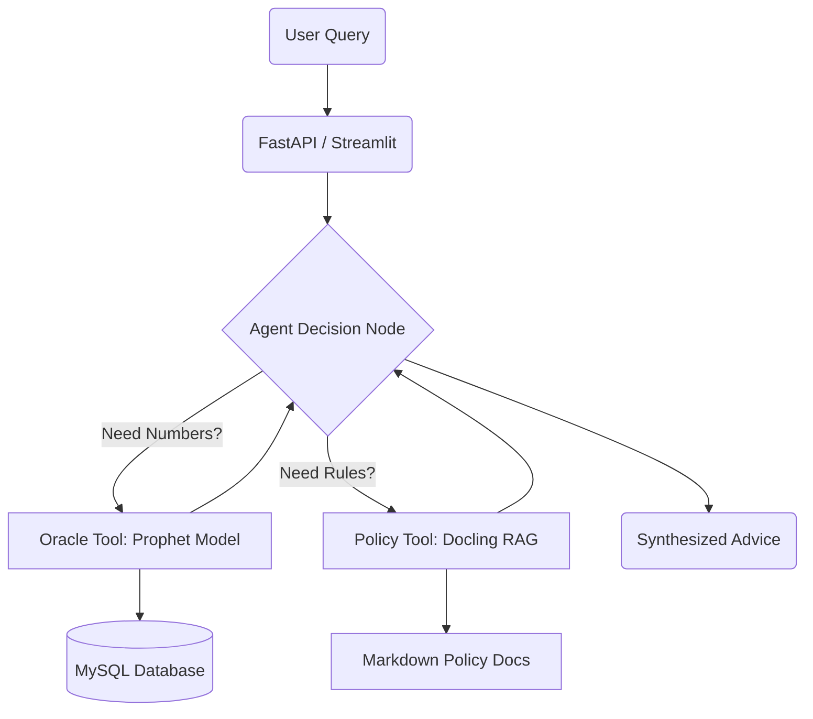

# 🛡️ Corporate Risk Sentinel (AI Agent)

### An Autonomous Financial Controller that predicts cash flow risks and enforces corporate policy.


## 📖 Overview

The **Corporate Risk Sentinel** is an autonomous AI agent designed to act as a "Financial Controller" for enterprise environments. Unlike standard chatbots, this system proactively monitors financial databases, forecasts future cash flow using statistical models, and autonomously retrieves specific corporate policies to recommend cost-saving actions when risks are detected.

It was built with a **$0 Budget Architecture**, utilizing open-source tools and local compute to mimic an enterprise setup without cloud costs.

---

## 📸 Interface ("Mission Control")

*(Place your `image_c9c322.png` or a screenshot of the full dashboard here)*

The dashboard features a split-view design:
* **Heads-Up Display:** Real-time metrics (Burn Rate, Risk Status) bridged from the Agent's memory.
* **Evidence Locker:** Visual proof (Forecast Plots) and citations (Active Policy text).
* **Command Center:** Chat interface for natural language interaction.

---

## 🏗️ Architecture

The system uses a **Tool-Calling Agent** architecture orchestrated by **LangGraph**.



### Key Components

1.  **The Brain (LangGraph):** A State Machine that decides *when* to check the database vs. *when* to read the policy. It enforces a strict protocol: `Analyze Data` -> `Detect Risk` -> `Consult Policy`.
2.  **The Oracle (Meta Prophet):** A dedicated time-series forecasting engine. It aggregates raw SQL transactions to predict 90-day burn rates, detecting seasonality and sudden trend changes (changepoints) that Linear Regression misses.
3.  **The Memory (MySQL):** A local SQL instance holding synthetic enterprise data (generated via Faker) to simulate realistic transaction volumes.
4.  **The Librarian (Docling):** An advanced RAG implementation. Instead of standard vector chunking (which breaks tables), I used **Docling** to convert PDF policies into structured Markdown, preserving the semantic logic of financial tables.

---

## 🚀 Installation & Setup

### Prerequisites
* Python 3.10+
* MySQL Server (Localhost)
* Groq API Key (Free Tier)

### 1. Clone the Repository
```bash
git clone [https://github.com/yourusername/Corporate-Risk-Sentinel.git](https://github.com/yourusername/Corporate-Risk-Sentinel.git)
cd Corporate-Risk-Sentinel
```

### 2. Set up Environment
```bash
# Install dependencies
pip install -r requirements.txt

# Create .env file
touch .env
```
**Add your credentials to `.env`:**
```ini
GROQ_API_KEY=gsk_...
DB_HOST=localhost
DB_USER=root
DB_PASSWORD=yourpassword
```

### 3. Initialize Data
Run the generator scripts to seed your local database and ingest the PDF.
```bash
# 1. Generate synthetic financial data (SQL)
python src/data_gen.py

# 2. Process the Policy PDF into Markdown (Docling)
python src/policy_process.py
```

### 4. Run the Application
```bash
streamlit run app.py
```

---

## 🧠 Engineering Decisions (Why I chose this stack)

### Why Docling instead of ChromaDB?
Standard RAG pipelines often fail on financial documents because they "chunk" text blindly, breaking rows in a table. By using **Docling** to pre-process the PDF into Markdown, I ensured the Agent reads tables as cohesive structures, allowing it to accurately interpret policies like *"If Department Spend > $50k, Then..."*.

### Why Prophet instead of Linear Regression?
Financial data is messy and seasonal (e.g., higher spend at month-end). Linear regression creates a flat line that misses these nuances. **Prophet** was chosen because it is robust to missing data and specifically designed to detect "Changepoints"—crucial for identifying the sudden "spending crash" simulated in this project.

### Why LangGraph?
A simple chain (A -> B -> C) wasn't enough. I needed a system that could **loop**. If the Agent reads the policy but doesn't find a relevant clause, LangGraph allows it to "think" and try a different search query before giving up.

---

## 🔮 Future Improvements
* **Dockerization:** Containerize the MySQL and App setup for one-click deployment.
* **Email Alerts:** Add a tool to draft an email to the CFO when risk is "CRITICAL".
* **Multi-Agent:** Separate the "Data Analyst" and "Compliance Officer" into two distinct agents that debate the solution.

---

## 📜 License
MIT License. Created for educational and portfolio purposes.
